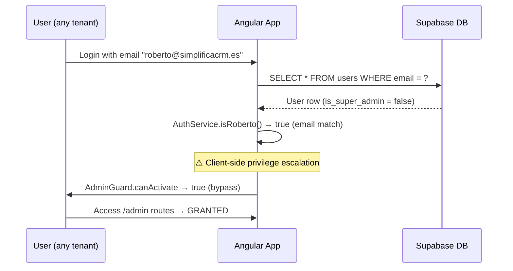
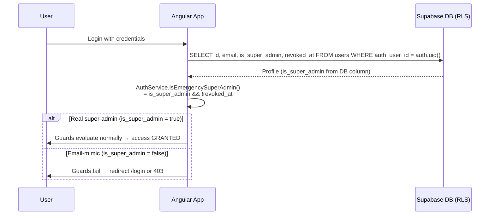

# Design: Remove Roberto email-based bypass

## Summary

Replace 25+ client-side `isRoberto()` email checks across the Angular
frontend with a single backend-validated `isEmergencySuperAdmin()` signal
sourced from `public.users.is_super_admin`. Add a `revoked_at` column for
defense-in-depth revocation. Migration is a precondition for the frontend
redeploy — without it, the real super-admin (Roberto) loses access.

## Architecture Decision Records

### ADR-1: DB column is the single source of truth

- **Context**: today, `AuthService.isRoberto()` returns `true` purely
  based on the literal email match `=== 'roberto@simplificacrm.es'`. This
  is checked client-side and short-circuits 5 guards + 4 features + 1
  layout. Anyone with admin access to `app.users` who sets that email on
  any user gets super-admin in any tenant.
- **Decision**: super-admin status MUST come exclusively from
  `public.users.is_super_admin` (boolean column, default false). The
  column is read via Supabase RLS into the JWT/session profile, and
  surfaced to the frontend as `userProfile.is_super_admin`.
- **Consequences**:
  - Promotion becomes a DB write performed by an existing super-admin
    via an authenticated Supabase session — auditable in standard
    Supabase audit logs.
  - Email-based bypass becomes architecturally impossible.
  - The real Roberto must be migrated via a one-shot SQL UPDATE in the
    new migration (gated by EXISTS check to be idempotent).

### ADR-2: Single isEmergencySuperAdmin signal in AuthService

- **Where**: `src/app/services/auth.service.ts`
- **Pattern**: a method (not signal — Angular service methods are
  idiomatic for imperative role checks) that reads the current profile
  signal and returns `!!profile?.is_super_admin && !profile?.revoked_at`.
- **Rationale**: one method, one source, all 25+ callsites delegate to
  it. Future "emergency break-glass" rules can be added in one place.

### ADR-3: revoked_at column for defense-in-depth

- **Why**: if a `users` row is compromised (e.g. laptop theft with
  valid session, leaked JWT), we need a way to revoke without deleting
  the row (which would cascade-delete historical invoices, bookings,
  etc.). Setting `revoked_at` invalidates super-admin checks
  immediately.
- **Behavior**: presence of non-null `revoked_at` causes
  `isEmergencySuperAdmin()` to return false. Session stays valid for
  audit purposes but admin checks fail.

## Sequence Diagrams

### Today's flow (broken)



### New flow (correct)



## Migration design

File: `supabase/migrations/20260619_remove_roberto_email_bypass.sql`

```sql
-- 1. Pre-flight: confirm idempotency
DO $$
BEGIN
  IF NOT EXISTS (
    SELECT 1 FROM public.users
    WHERE email = 'roberto@simplificacrm.es'
      AND is_super_admin = true
  ) THEN
    -- 2. One-shot promotion: only runs if not already super-admin
    UPDATE public.users
    SET is_super_admin = true,
        updated_at = now()
    WHERE email = 'roberto@simplificacrm.es'
      AND is_super_admin IS DISTINCT FROM true;
  END IF;
END $$;

-- 3. Add revoked_at column for emergency revocation
ALTER TABLE public.users
  ADD COLUMN IF NOT EXISTS revoked_at timestamptz;

-- 4. Index for fast revocation queries
CREATE INDEX IF NOT EXISTS idx_users_revoked_at
  ON public.users (revoked_at)
  WHERE revoked_at IS NOT NULL;

-- 5. Policy documentation
COMMENT ON COLUMN public.users.is_super_admin IS
  'Super-admin flag. MUST be set by an existing super-admin via authenticated Supabase session. No email-based grants.';
COMMENT ON COLUMN public.users.revoked_at IS
  'When non-null, the user is revoked. isEmergencySuperAdmin() returns false. Session stays valid for audit.';
```

The migration is **idempotent**: the pre-flight `EXISTS` check ensures
the UPDATE only runs if needed, and `ADD COLUMN IF NOT EXISTS` /
`CREATE INDEX IF NOT EXISTS` are safe to re-run.

## Frontend refactor pattern

For each of the 25+ callsites, apply:

```typescript
// BEFORE
if (this.auth.isRoberto()) { ... }

// AFTER
if (this.auth.isEmergencySuperAdmin()) { ... }
```

The new method implementation:

```typescript
isEmergencySuperAdmin(): boolean {
  const profile = this.userProfileSignal();
  return !!profile?.is_super_admin && !profile?.revoked_at;
}
```

### Callsites to update

1. `src/app/services/auth.service.ts` — drop isRoberto(), add isEmergencySuperAdmin(), remove 2 EMERGENCY BYPASS blocks, remove 2 email checks
2. `src/app/guards/auth.guard.ts` — 5 sites
3. `src/app/core/guards/no-roberto.guard.ts` — refactor or rename to not-emergency-guard.ts
4. `src/app/core/guards/staff.guard.ts` — 2 sites
5. `src/app/features/admin/modules/modules-admin.component.ts` — 1 site
6. `src/app/features/agenda/agenda.component.ts` — 1 site
7. `src/app/features/calendar/calendar.component.ts` — 1 site
8. `src/app/features/customers/supabase-customers/supabase-customers.component.ts` — 1 site
9. `src/app/shared/layout/mobile-bottom-nav/mobile-bottom-nav.component.ts` — ROBERTO_EMAIL + isRobertoDetected + log line

## Testing strategy

- **Unit tests** (`*.spec.ts`): add coverage for `isEmergencySuperAdmin`
  with three cases (true DB flag, revoked DB flag, missing DB flag).
- **Verification grep** (`sdd-verify` automated):
  ```bash
  grep -rn "isRoberto\|roberto@simplificacrm" src/ --include="*.ts" \
    | grep -v ".spec.ts" \
    | grep -v "simple-supabase.service.ts"  # legacy fixture, see note
  ```
  Must return empty.
- **Manual smoke**: deploy to staging, login as real Roberto (DB
  column = true) → admin routes work. Create test user with that email
  but column = false → admin routes blocked.

### Note: simple-supabase.service.ts

The grep returns 1 match at `src/app/services/simple-supabase.service.ts:531`:
`email: 'roberto@anscarr.es'` (note: different domain — `anscarr.es`,
not `simplificacrm.es`). This is a separate legacy fixture in the demo
service, not a security bypass. Out of scope for this change.

## Rollback

Single PR revert. Risk if rollback needed in prod:
- Frontend goes back to email-based bypass (vulnerable state restored)
- Migration is forward-only: `users.is_super_admin` retains the true value
  for Roberto; `revoked_at` column is harmless if unused

This is acceptable because the rollback path is only used in an
emergency, and re-introducing the email bypass is bad but better than a
hard outage.

## Affected modules

- `simplifica-crm/src/app/services/auth.service.ts`
- `simplifica-crm/src/app/guards/auth.guard.ts`
- `simplifica-crm/src/app/core/guards/no-roberto.guard.ts` (renamed/deleted)
- `simplifica-crm/src/app/core/guards/staff.guard.ts`
- `simplifica-crm/src/app/features/admin/modules/modules-admin.component.ts`
- `simplifica-crm/src/app/features/agenda/agenda.component.ts`
- `simplifica-crm/src/app/features/calendar/calendar.component.ts`
- `simplifica-crm/src/app/features/customers/supabase-customers/supabase-customers.component.ts`
- `simplifica-crm/src/app/shared/layout/mobile-bottom-nav/mobile-bottom-nav.component.ts`
- `simplifica-crm/supabase/migrations/20260619_remove_roberto_email_bypass.sql` (new)

## Estimated changed lines

| File | Est. lines removed | Est. lines added |
|------|---|---|
| auth.service.ts | ~30 | ~6 |
| auth.guard.ts | ~25 | ~0 |
| no-roberto.guard.ts (rename) | ~20 | ~20 |
| staff.guard.ts | ~6 | ~0 |
| 4 feature components | ~8 | ~4 |
| mobile-bottom-nav | ~15 | ~10 |
| New migration | 0 | ~35 |
| **Total** | **~104** | **~75** |

Net: **~30 lines removed**. Well under 400-line budget.